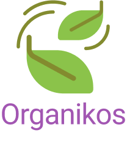
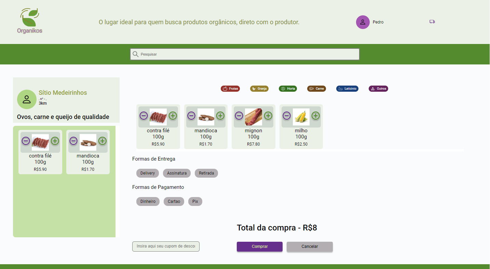

<div align="center"> 

</div>

# Organikos

## Plataforma
Acesse nossa plataforma por aqui [Organikos](https://organikos.netlify.app/)
## Conceito do Projeto
Com o Organikos você descobre produtores próximos, que entregam na sua casa, alimentos saudáveis e baratos. Através da nossa plataforma você pode encontrar diversas opcões de alimentos orgânicos vendidos diretamente dos produtores.
Melhore sua saúde e de sua família, e ainda ajude a incentivar a produção de mais alimentos saudáveis livres de agrotóxicos. Utilize cupons de desconto e economize ainda mais, enquanto se alimenta melhor, e sem ter que ir ao mercado.

### To-Di List
- [X] Criação da página Login e integração com a API de usuários
- [X] Criação da página Home e integração com a API de sellers
- [X] Criação da página Seller e integração com a API de produtos
- [X] Criação da página Checkout 
- [X] Criação da página Details
- [X] Criação da página Feedback
- [X] Criação da página Bag e integração com CartData
- [X] Criação da página Historic
- [X] Criação da página PersonalData
- [X] Criação da página Address
- [X] Criação da página Payment
- [ ] Integração Historic com API
- [ ] Integração Checkout, Details, Feedback com API
- [ ] Integração PersonalData com API
- [ ] Integração Asdress com API
- [ ] Integração Payment com API
- [ ] Criação página cadastro

## Pré-requisitos e recursos utilizados
Para realização do projeto foram utilizadas as seguintes ferramentas

1. [react-router-dom](https://reactrouter.com/en/main)
2. [styled-components](https://styled-components.com/)
3. [uuid](https://www.npmjs.com/package/uuid)
4. [react-loading-skeleton](https://www.npmjs.com/package/react-loading-skeleton)
5. [axios](https://axios-http.com/ptbr/docs/intro)
6. [formik](https://formik.org/docs/overview)
7. [yup](https://www.npmjs.com/package/yup)
8. [react-tooltip](https://www.npmjs.com/package/react-tooltip)
9. [react-switch](https://www.npmjs.com/package/react-switch)
10. [react-toastify](https://fkhadra.github.io/react-toastify/introduction)

# Passo a passo
1. Os times de design, backend e frontend se reuniram para definição do projeto
2. Após receber as telas prontas definimos as prioridades do que deveria ser feito
3. Criamos os componentes básicos que poderiam ser utilizados no projeto todo
4. Montamos as telas seguindo o protótipo 
5. Fizemos os reviews junto ao time de design
6. Integramos com a API e definimos as rotas usando react-router-dom
7. Revisamos o que tinha sido feito à procura de bugs e melhorias

## Instalação
Para instalar as dependências do projeto localmente, utilize a instrução abaixo:
1. Clonar o projeto usando ```git clone https://github.com/estartandodevs-course/organikos-frontend.git```
2. Abra o projeto e digite no terminal ```yarn install``` e espere pela instalação das dependências, após isso, siga para a etapa de [Execução](#Execução)

## Execução
Para executar o programa
1. Instale as  dependências usando o comando ```yarn``` no terminal
2. Após isso digite no terminal ```yarn start``` para rodar o projeto em modo desenvolvimento.

## Autores
Desenvolvedores: 
* Lucas Silva ([lucasSlv](https://github.com/lucasSlv))
* Pablo Kauã ([pablokaua](https://github.com/pablokaua))

Monitor:
* Ramon Xavier ([ramonxm](https://github.com/ramonxm)) ❤

## Imagens/screenshots
Login
<div align="center"> 

</div>
Home
<div align="center"> 

</div>
Seller
<div align="center"> 

</div>

## Agradecimentos
<div align="center"> 

</div>

Um agradecimento especial a toda equipe do [Estartando Devs](https://www.estartandodevs.com.br/) que durante todo curso
nos ajudaram a nos desenvolver como profissionais e como pessoas. Nada disso seria possível sem a ajuda e carinho que vocês
depositam nesse projeto ❤


